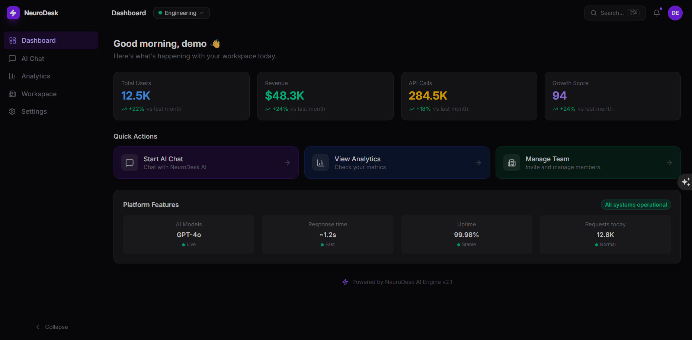
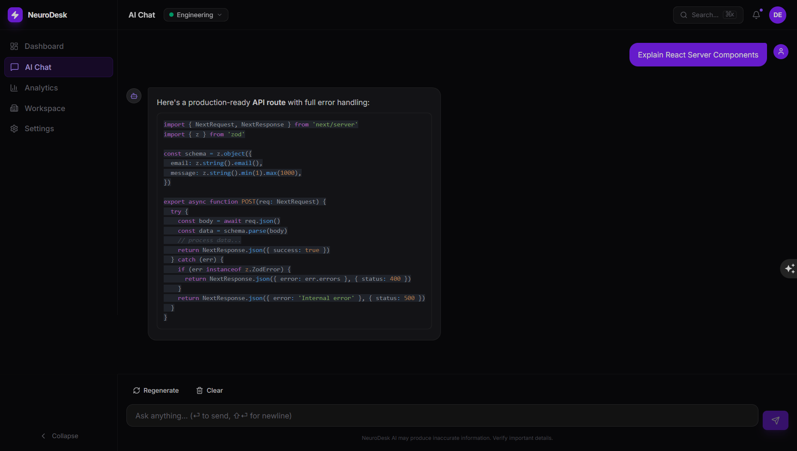
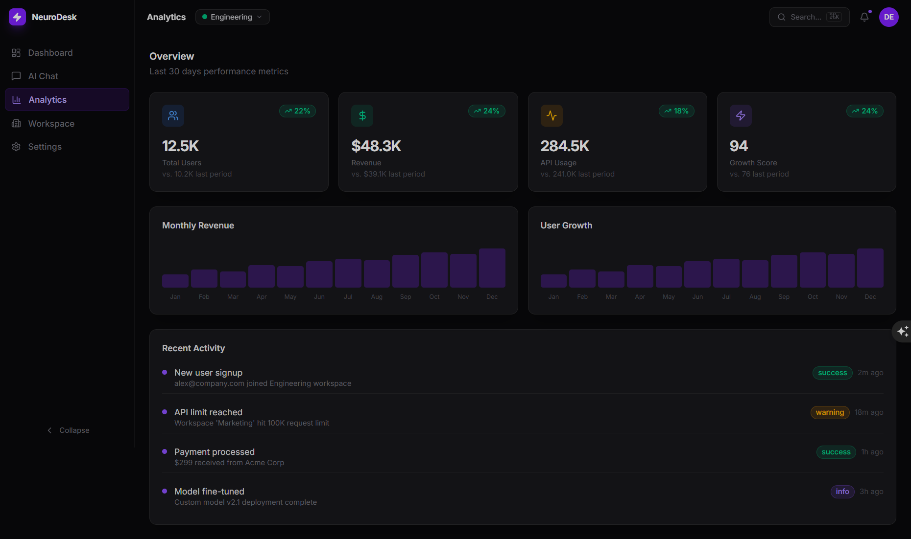
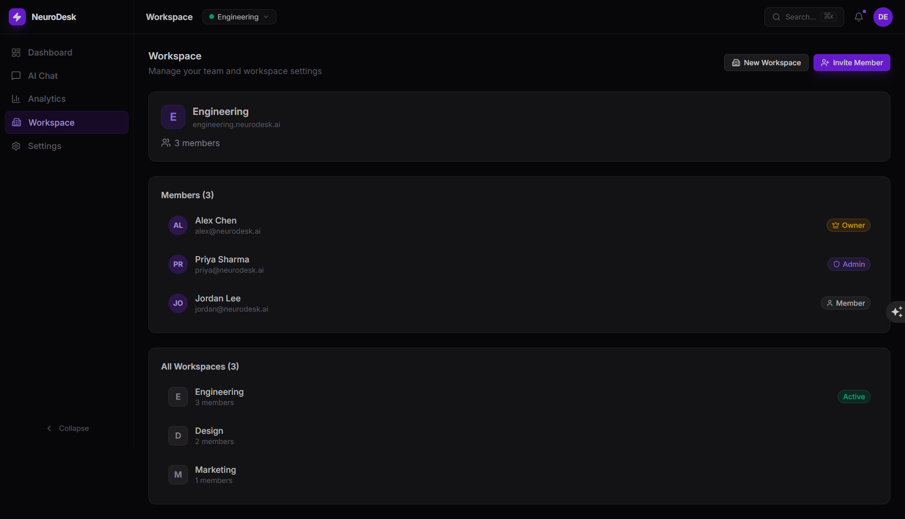
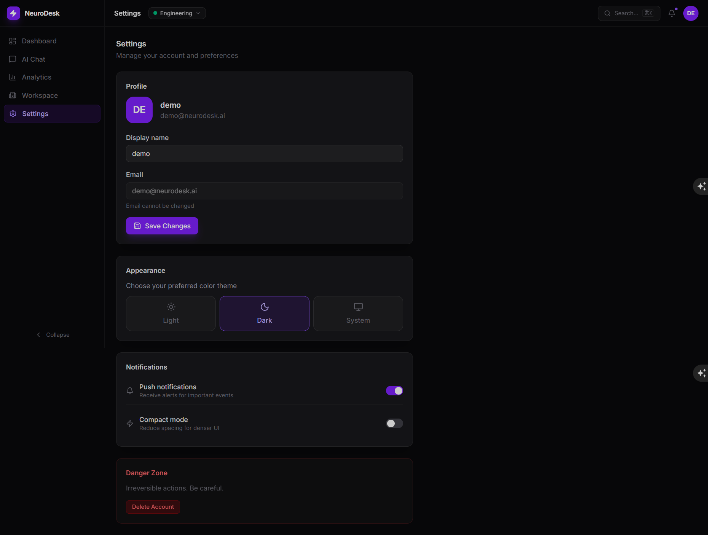

# NeuroDesk — AI Productivity Dashboard

> A production-grade SaaS frontend built  
> Built with Next.js 14 App Router, TypeScript strict mode, and a fully componentized design system.


**Live Demo → [neurodesk-red.vercel.app](https://neurodesk-red.vercel.app)**  
**Demo login:** `demo@neurodesk.ai` / `password123`

---



---

## Overview

NeuroDesk is a full SaaS dashboard product — not a tutorial project. It demonstrates real frontend architecture decisions you would make at a top tech company: feature-based folder structure, separated state layers, streaming UI, accessible component design, and performance patterns like memoization and code splitting.

Built as an internship portfolio project targeting FAANG frontend roles.

---

## Screenshots

### AI Chat — Streaming markdown with code highlighting


### Analytics — KPI cards, animated charts, activity feed


### Workspace — Multi-workspace management and member roles


### Settings — Theme switcher, profile, preferences


---

## Features

### Authentication
- Email/password login and registration with full validation
- NextAuth.js JWT sessions with protected routes via middleware
- Zod schema validation on all form inputs
- Graceful error states and redirect flows

### AI Chat System
- Word-by-word streaming text simulation (like ChatGPT)
- Full markdown rendering with syntax-highlighted code blocks
- Copy button per code block, regenerate last response
- Typing indicator, empty state, error state
- Auto-scroll to latest message
- Zustand-powered message store with full history

### Analytics Dashboard
- KPI cards with real growth calculations and trend indicators
- Skeleton loading states while data fetches
- Animated bar charts for monthly revenue and user growth
- Live activity feed with categorized event badges
- TanStack Query for data fetching with caching

### Workspace System
- Multi-workspace support with instant switching
- Create new workspaces with modal form
- Invite members by email
- Member list with role badges (Owner, Admin, Member)

### Settings
- Profile editing with save state feedback
- Theme switcher: Light / Dark / System
- Toggle preferences: notifications, compact mode
- Danger zone with destructive action controls

### Design System (8 Components)

Every component ships with loading, disabled, and error states, full ARIA labels, and keyboard navigation support.

| Component | Variants |
|---|---|
| `Button` | primary, secondary, ghost, danger, outline + loading state |
| `Input` | with label, error message, hint text |
| `Card` | default, ghost, bordered |
| `Modal` | animated, focus-trapped, Escape to close |
| `Dropdown` | keyboard navigable, click-outside to close |
| `Badge` | default, success, warning, danger, info |
| `Skeleton` | pulse animation for any loading state |
| `Tooltip` | top, bottom, left, right positioning |

---

## Tech Stack

| Layer | Technology | Why |
|---|---|---|
| Framework | Next.js 14 (App Router) | Server Components, streaming, edge-ready |
| Language | TypeScript (strict) | Type safety across every file |
| Styling | Tailwind CSS | Utility-first, no CSS bloat |
| UI State | Zustand | Minimal, performant, no boilerplate |
| Server State | TanStack Query | Caching, background refetch, loading states |
| Auth | NextAuth.js | JWT sessions, extensible providers |
| Animation | Framer Motion | Production-quality motion primitives |
| Forms | React Hook Form + Zod | Uncontrolled forms with schema validation |
| Markdown | React Markdown + Prism | Syntax-highlighted code in chat |

---

## Architecture

```
neurodesk/
├── app/                        # Next.js App Router
│   ├── dashboard/              # Protected dashboard routes
│   │   ├── layout.tsx          # Auth guard + shell layout
│   │   ├── page.tsx            # Main dashboard (Server Component)
│   │   ├── chat/page.tsx
│   │   ├── analytics/page.tsx
│   │   ├── workspace/page.tsx
│   │   └── settings/page.tsx
│   ├── login/page.tsx
│   ├── signup/page.tsx
│   ├── api/
│   │   ├── auth/[...nextauth]/route.ts
│   │   └── register/route.ts
│   ├── layout.tsx              # Root layout + providers
│   └── providers.tsx           # SessionProvider + QueryClientProvider
│
├── features/                   # Feature modules (collocated logic + UI)
│   ├── chat/
│   │   ├── chat-interface.tsx
│   │   └── markdown-renderer.tsx
│   ├── analytics/
│   │   └── analytics-dashboard.tsx
│   ├── workspace/
│   │   └── workspace-panel.tsx
│   └── settings/
│       └── settings-panel.tsx
│
├── components/
│   ├── ui/                     # Design system primitives
│   │   ├── button.tsx
│   │   ├── input.tsx
│   │   ├── card.tsx
│   │   ├── modal.tsx
│   │   ├── dropdown.tsx
│   │   ├── badge.tsx
│   │   ├── skeleton.tsx
│   │   └── tooltip.tsx
│   └── layout/                 # Shell components
│       ├── dashboard-shell.tsx
│       ├── sidebar.tsx
│       ├── topnav.tsx
│       └── workspace-switcher.tsx
│
├── store/                      # Zustand stores (UI state only)
│   ├── chat-store.ts
│   ├── ui-store.ts
│   └── workspace-store.ts
│
├── lib/                        # Shared utilities
│   ├── utils.ts                # cn(), formatNumber(), debounce()
│   ├── mock-data.ts            # Typed mock data layer
│   └── auth-options.ts         # NextAuth configuration
│
└── types/
    └── index.ts                # Global TypeScript types
```

### State Architecture

State is strictly separated by concern — never mixed:

| State Type | Tool | Examples |
|---|---|---|
| UI State | Zustand (persisted) | sidebar open, active route, theme |
| Server State | TanStack Query | analytics data, user lists |
| Auth State | NextAuth | session, JWT token |
| Form State | React Hook Form | login form, invite form |

### Rendering Strategy

- **Server Components** by default — data fetching, layouts, static content
- **Client Components** only where needed — chat UI, forms, modals, animations
- **Middleware** protects all `/dashboard/*` routes before rendering

---

## Performance Patterns

- `React.memo` on all list-rendered components (`MessageBubble`, `KPICard`, `MiniChart`)
- `useCallback` on all event handlers inside memoized components
- Zustand with `persist` middleware — state survives page refresh without extra fetches
- Framer Motion `AnimatePresence` for layout-safe exit animations
- Debounced search input pattern in `lib/utils.ts`
- Code splitting via Next.js App Router automatic chunking per route

---

## Accessibility

- Semantic HTML throughout (`<header>`, `<nav>`, `<main>`, `<aside>`)
- ARIA labels on all interactive elements
- `aria-live="polite"` on chat message container for screen readers
- `role="dialog"` and `aria-modal` on modals with Escape to close
- `role="switch"` on toggle buttons with `aria-checked`
- `aria-current="page"` on active sidebar nav items
- Keyboard navigation: Escape closes modals, Enter submits forms
- Visible focus rings on all focusable elements via `focus-visible`
- Color contrast meets WCAG AA on all text elements

---

## Getting Started

### Prerequisites

- Node.js 18+
- npm or yarn

### Local Development

```bash
# Clone the repo
git clone https://github.com/frontend-kavindi/neurodesk.git
cd neurodesk

# Install dependencies
npm install

# Start dev server
npm run dev
```

Open [http://localhost:3000](http://localhost:3000)

**Login with any credentials:**
```
Email:    demo@neurodesk.ai
Password: password123
```

### Environment Variables

Create a `.env.local` file in the root:

```env
NEXTAUTH_SECRET=your-secret-key-min-32-chars
NEXTAUTH_URL=http://localhost:3000
```

---

## Deployment

### Vercel (Recommended)

```bash
npm install -g vercel
vercel deploy
```

Set environment variables in the Vercel dashboard:

| Variable | Value |
|---|---|
| `NEXTAUTH_SECRET` | any random 32+ character string |
| `NEXTAUTH_URL` | your production URL e.g. `https://yourapp.vercel.app` |

Then redeploy:
```bash
vercel --prod
```

---

## Roadmap

- [ ] Connect real LLM API (OpenAI / Anthropic)
- [ ] Persistent storage with Prisma + PostgreSQL
- [ ] Real-time notifications with Pusher
- [ ] File upload support
- [ ] OAuth providers (Google, GitHub)
- [ ] Usage billing dashboard

---

## Author

**Kavindi Gamage**  
 
[GitHub](https://github.com/frontend-kavindi)

 
